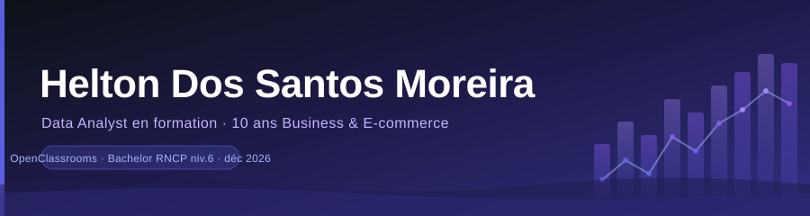

<div align="center">

</div>

<br/>

<div align="center">


<br/><br/>

[](https://www.linkedin.com/in/helton-dsm-data)
[](mailto:heltonmail8@gmail.com)
</div>

---

Avant de savoir ce qu'était un Data Analyst,
**j'en faisais déjà un tous les jours.**

> Management de 8 personnes avec des dashboards Excel faits maison chez HUBSIDE<br/>
> 10 sites e-commerce pilotés via Google Analytics chaque matin<br/>
> Reporting commercial au groupe ADEO (BRICOMAN) sans jamais appeler ça "data"<br/>

Un moment, j'ai décidé de le faire proprement.

---

## 🔧 En ce moment

```text
📚  Formation Data Analyst — OpenClassrooms (bachelor RNCP niv.6, déc 2026)
🗄️  SQL avancé : modélisation relationnelle, requêtes complexes, BDD SQLite
🐍  Python data : Pandas, NumPy, Matplotlib, Seaborn, séries temporelles
📊  Power BI & visualisation — en cours
```

---

## 🛠️ Stack

<div align="center">

**Langages**


**Analyse & Visualisation**


**Bases de données**


**Environnement**


</div>

---

## 🗂️ Projets

### 🛒 [Analyse de performance e-commerce](https://github.com/Heltondsm/analyse-ventes-ecommerce)


Un site pivote sa stratégie marketing. Je mesure l'impact réel : trafic **×30**, conversion à **5%** (vs 3% marché), deux profils clients distincts identifiés. Recommandation présentée à la direction.

---

### 🏠 [Exploration SQL — Portefeuille assurances habitation](https://github.com/Heltondsm/sql-assurances-habitation)


**50 000+ contrats** à explorer. Jointures, agrégations, sous-requêtes, vues — pour répondre aux vraies questions que le métier se pose.

---

### 🌍 [Sous-nutrition mondiale — Données FAO](https://github.com/Heltondsm/etude-sante-publique-fao)


**528 millions de personnes** sous-alimentées alors que la production mondiale couvre 94% des besoins. 4 datasets FAO, 11 analyses. Conclusion inattendue : ce n'est pas un problème de production — c'est un problème de distribution.

---

### 📈 [Prévision de ventes — Modèle SARIMA](https://github.com/Heltondsm/ecommerce-sales-analysis-sarima)


Anticiper les ventes, pas juste les constater. Décomposition de série temporelle, analyse de saisonnalité, modèle SARIMA avec intervalles de confiance.

---

## 💼 Parcours

<div align="center">

| Période | Rôle |
|:---:|---|
| 2022 – présent | **Entrepreneur E-commerce** — 10 sites Shopify · Google Analytics · Google Ads |
| 2022 – 2024 | **Directeur adjoint HUBSIDE** — dashboards · KPIs · management 8 personnes |
| 2020 – 2022 | **Consultant technique BRICOMAN** (Groupe ADEO) — reporting B2B |

</div>

---

<div align="center">
<sub>Formation en cours · Bachelor Data Analyst · OpenClassrooms · déc 2026</sub>
</div>
